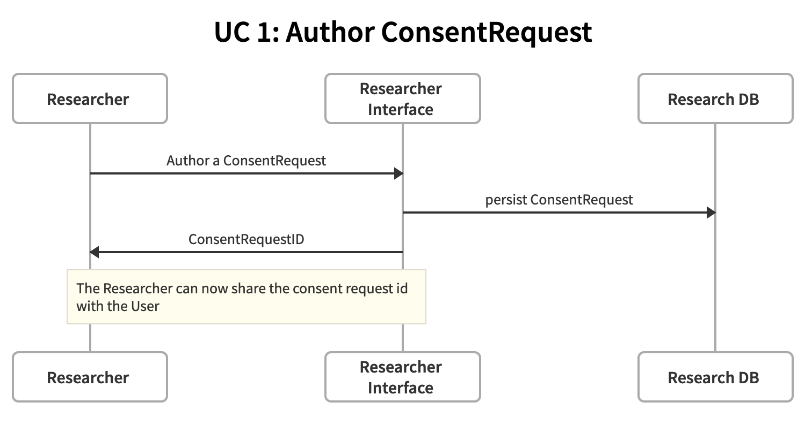
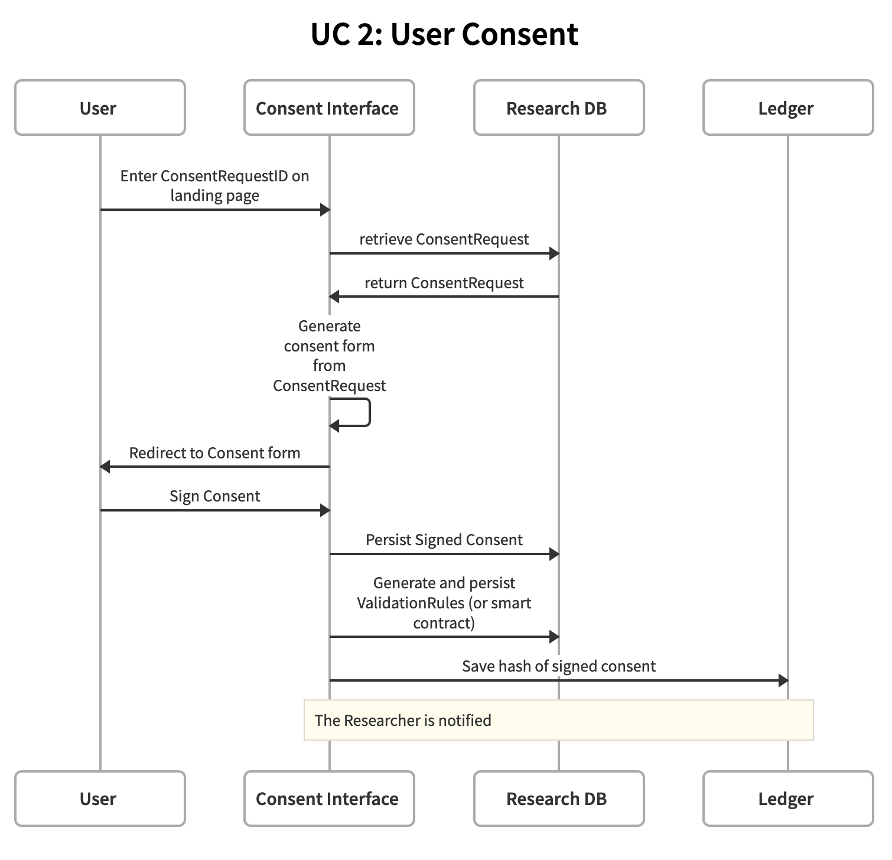
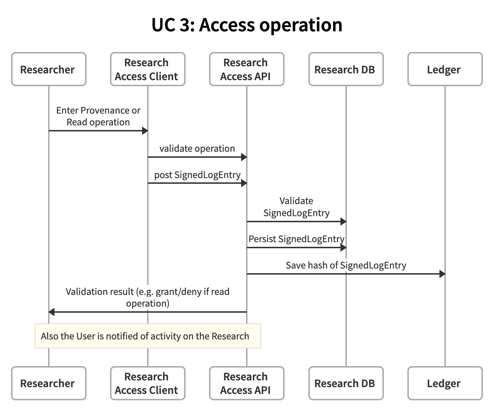
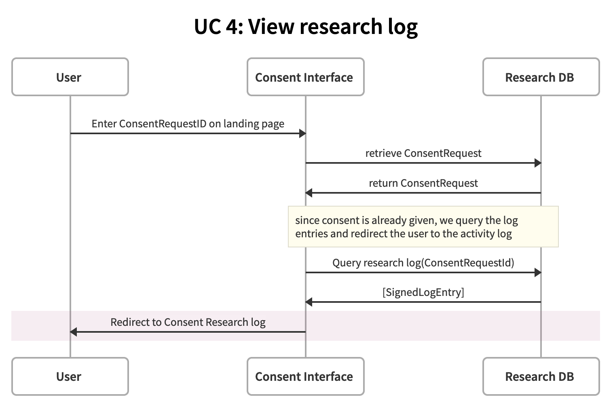

# GeneCoop Demonstrator Technical Design

## Introduction

This document describes the technical design of the first GeneCoop demonstrator.

A first prototype of the Demonstrator is online: the [Researcher Interface](http://135.181.106.35/request/) and the [Consent Interface](http://135.181.106.35/consent/).

In this demonstrator a researcher invites a user to participate in a specific research,
the user is asked to give consent for the use of their genetic data through GeneCoop.
Also through GeneCoop, the researcher informs the user as the research progresses.

For more general information and a general introduction, read the [Research Plan](https://docs.google.com/document/d/1Z6wJhNQJs-_C1EdtdfLkvyhGmBLb4LybSc6Z8ZP2SdQ/edit).

## 1. Architecture overview and glossary of terms

There are two types of user in this demonstrator:

* **User**, this is the person that takes part in the research
* **Researcher**, this is the person that invites the User to take part in his research,  performs the research and keeps the User informed during the research

The bulk of the demonstrator will be implemented as a web application using the [Django](https://www.djangoproject.com/) framework.

Inside the GeneCoop web application we see the following components:

* **Researcher Interface**, used by the researcher to author the operational details of the research that will be tracked 
* **Research DB**, contains all information that is needed to track the research
* **Research Access API**, enables the tracking of research from outside the Genecoop web application
* **Consent Interface**, this is the user facing part of the Genecoop web application, where a user gives consent and can see how the research progresses.

Outside the main web application we see the following components:

* **Research Access Client**, used by the researcher to check and control access about the research. Since this will be automated in the future it is good to think of it as being outside of GeneCoop.
* **Ledger**, In order to make LogEntries immutable and auditable we want to store receipts of all important operations (Provenance and Access operations) here. (For now we think this will be something that we mock up with a read only table in Postgres, but we are considering Sawtooth / Zencode interface at a later stadium)

There are a couple of important data structures to mention:

* **ConsentRequest**, this is a data structure that describes all operations that will take place during the research. From this Request, a consent form can be generated that the User will fill in. Also it provides the data that is necessary to create the validation rules for access during the research.
* **SignedConsent**, this is a record of what the User gave his consent for. An signed immutable document based on the ConsentRequest.
* **LogEntry**, this is a signed record of a Provenance or Access operation on the data under research.   

## 2. Use Cases

### 2.1 Use Case 1: Author ConsentRequest
In a web interface, the researcher composes the operations of the research that will be conducted.
A ConsentRequestId or AccessKey tied to this consent request is generated (or specified) that can be distributed to the User.

### 2.2 Use Case 2: User Consent
After receiving the the AccessKey, the user goes to the GeneCoop website and enters the AccessKey somewhere on the landing page. A Consent form based on the ConsentRequest authored in UC1 is presented to the user, who gives consent. A consent document is generated and signed with a key belonging to the User. (We need to work this out further, we are considering to use zenroom to generate public/private keys for this. Probably the generation of a keypair is part of the giving consent process, where the user is prompted to come up with a password for example. 
Also, based on the operations specified in the ConsentRequest, a set of ValidationRules associated with this Consent should be created and stored for later use by the Access API to control access to the data under research. We are considering to use a DSL for this purpose, one of which is zencode.  

### 2.3 Use Case 3: Access Operation
Now that the Consent is available, the researcher can conduct research and log operations relating to the research.
Using the Research Access Client, the researcher specifies an operation and consentRequestId.
Through the Access API, operations are validated, and LogEntries are created for each operation, for example "access to do analysis pt 1." or "created array data during analysis pt 1."
Each LogEntry is signed by the Researcher, and a hash of the entry is stored on the ledger
The contents of the LogEntry could be encrypted with the public key of the User, but we're not sure about that yet.
 

### 2.4 Use Case 4: View research log
As the research progresses, the User is notified of operations that were performed as part of the research.
With the original AccessKey the User get access to the Log history panel via the Landing page.
(Optionally using a password created during the consent process)
 

